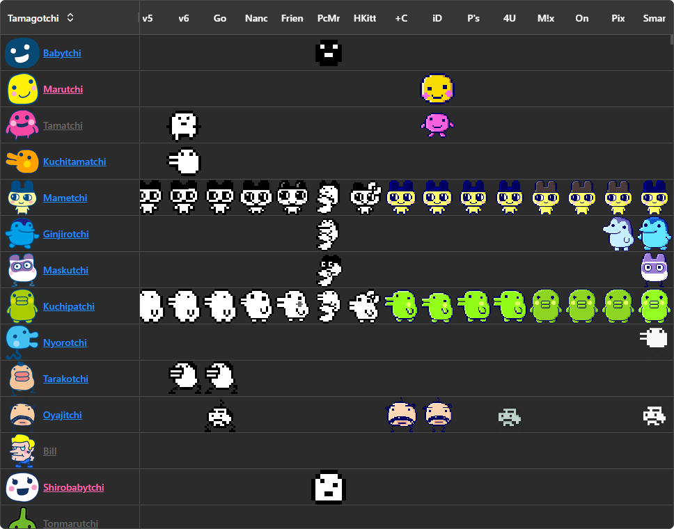
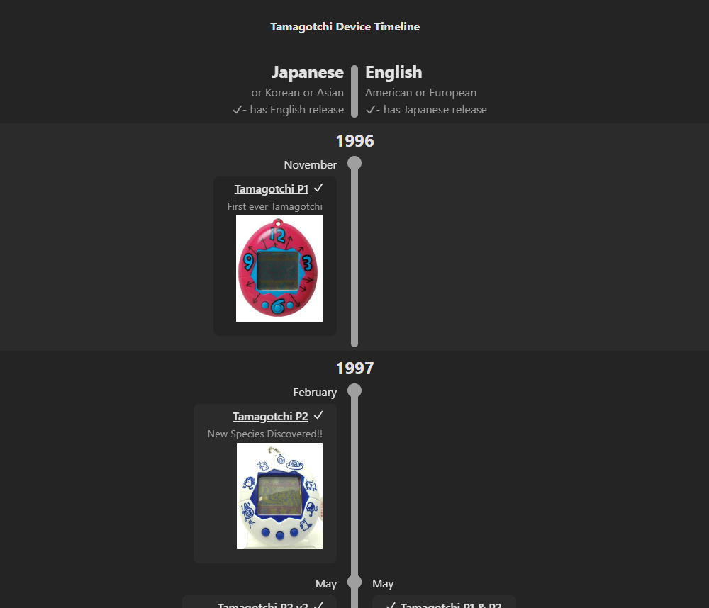
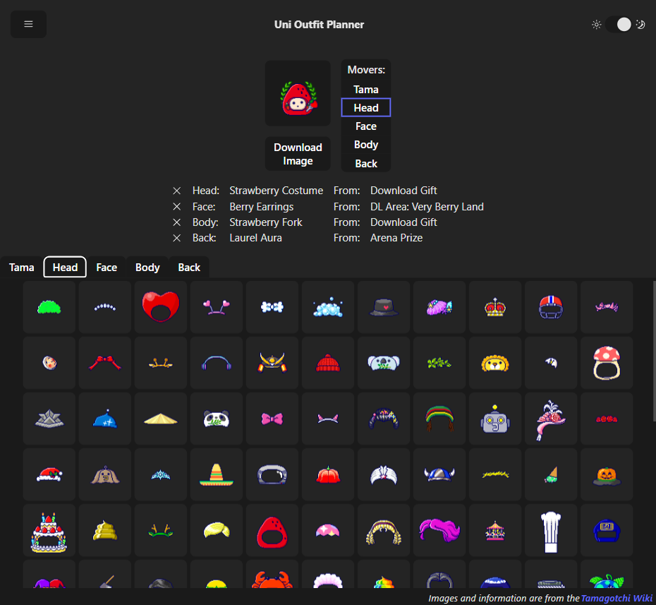
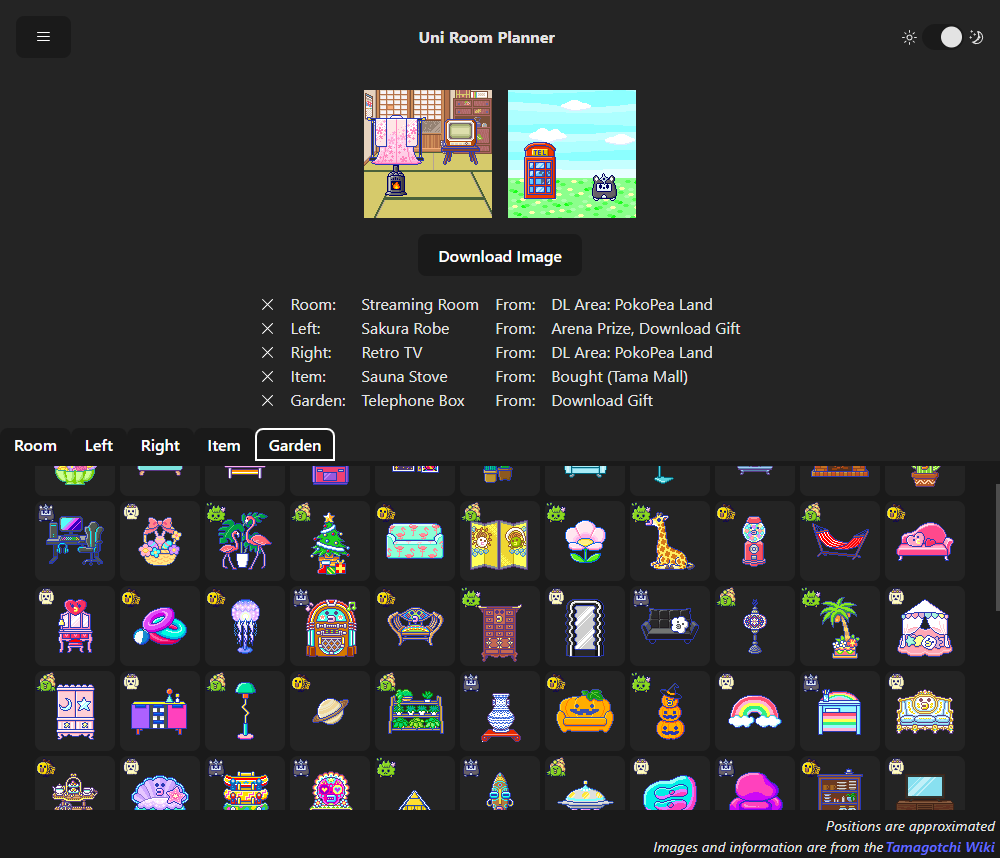
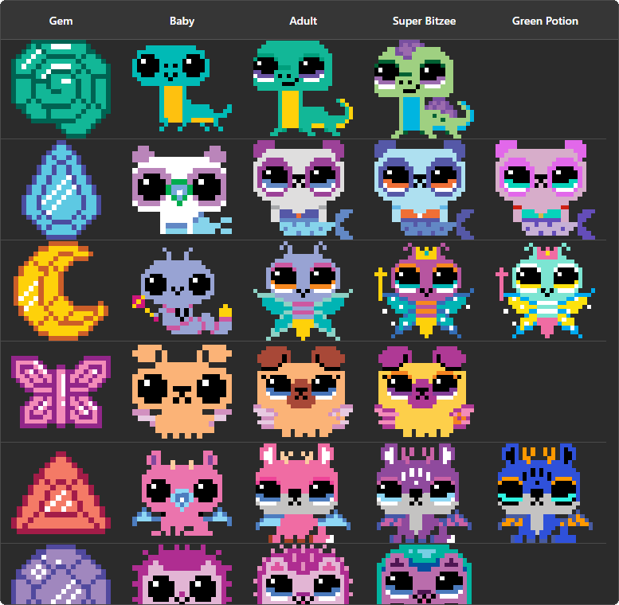

# Raven's Tamagotchi resources

This website houses resources I have created for the Tamagotchi community and links to external resources.

## Features

* Table of all raisable Tamagotchi characters 
* Timeline of Tamagotchi device releases 
* Outfit planner for Uni accessories 
* Planner for Uni rooms 
* Table of Bitzee Magical sprites and their potion recolors (WIP)
  

## Planned Features

Note that I work on this in my free time and mostly prioritize based on my own interests. Don't hold your breath waiting
for a feature release.

* Compilation of external tama resources - resources I've found useful made by others in the community and also links to
  their shops
* Table of alternate forms - costumes, changes, transformations, personality stages etc.
* Raisable characters from other tamas - show a table with row representing the characters (i.e. Angel, Nanos...)
* All Raisable Digimon Characters - similar to "All Raisable Tamagotchi Characters" but for Digimon

## Sources

* Most images and info are sourced from [Tamagotchi wiki](https://tamagotchi.fandom.com/wiki/Main_Page)
* Bitzee sprites are drawn based
  on [official manual](https://cdn.prod.website-files.com/64148f40b7ac5b4d987032a0/663a87bdbd2ec3d43494d1d6_T22900_0006_20145304_GML_IS_R1%20(BIT_Interactive_Digital_Pet_Magicals_Web_English_F24).pdf)
